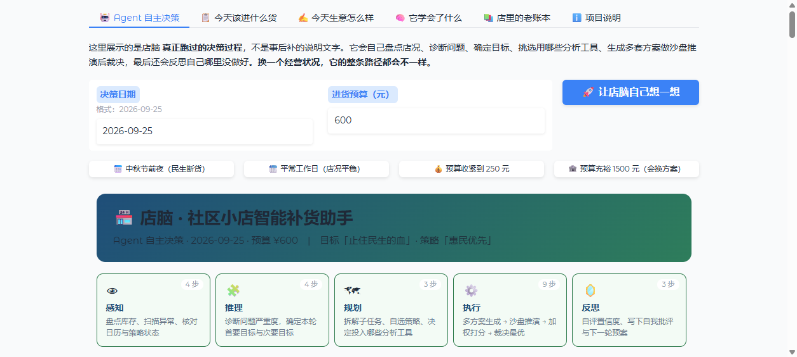
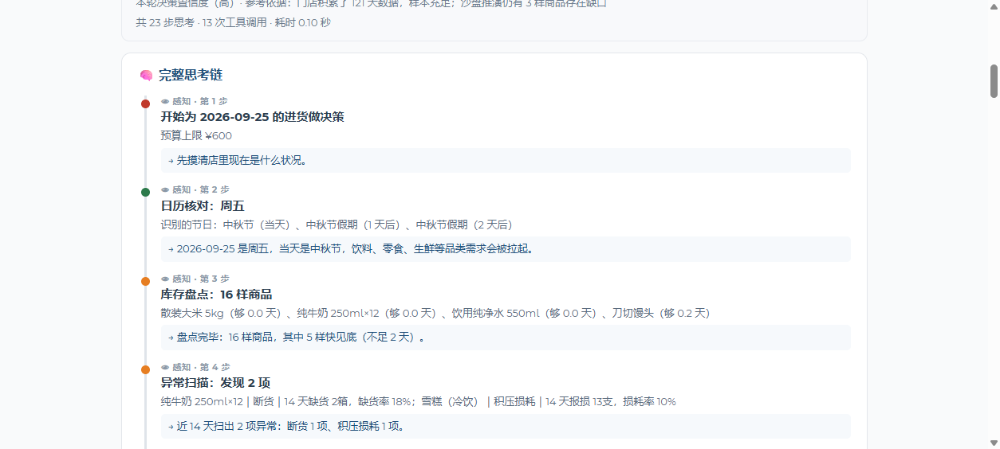

# 店脑 · 面向社区夫妻小店的智能补货决策 Agent

> 用最前沿的技术（记忆与自进化），去解决最朴素但最刚需的问题（帮小店老板管好进货）。

社区夫妻小店是城市重要的便民基础设施，但店主大多没有数据分析能力，全凭经验进货，
结果两头吃亏：**要么商品积压损耗，要么刚需日用品断货**。
市面上的进销存与智能补货系统几乎都面向大型商超，部署复杂、收费高昂，小店主用不上也用不起。

店脑是一款轻量化的智能补货决策 Agent：浏览器打开即用，无需专业硬件，
在追求门店经营收益的同时加入**惠民约束**，兼顾小店抗风险能力与社区居民的便民需求。

---

## 核心界面：Agent 的决策循环是看得见的



每一步思考都带阶段标签、依据与结论，店主能一路追问"为什么是这个数"。



---

## 一、快速开始

**在线体验（免安装）：** https://diannao-replenish.app.workbuddy.host/

本地运行：

```bash
# 1. 安装依赖（国内网络建议加 -i https://mirrors.aliyun.com/pypi/simple/）
pip install -r requirements.txt

# 2. 启动网页界面（首次运行会自动生成门店历史数据）
python app.py
# 浏览器打开 http://127.0.0.1:7861
```

命令行完整演示（答辩用，一次性跑通六幕闭环）：

```bash
python demo_flow.py
```

单独重新生成门店历史数据：

```bash
python seed_data.py
```

---

## 二、界面导览

| 标签页 | 面向谁 | 内容 |
|---|---|---|
| 🤖 **Agent 自主决策** | 店主 / 评委 | **核心页**：完整决策循环轨迹、工具调用、方案博弈、自我反思 |
| 📋 今天该进什么货 | 店主 | 一屏给出补货建议单；点"和传统算法比一比"看两种算法的分歧 |
| ✍️ 今天生意怎么样 | 店主 | 录入昨日实际销售/断货/损耗，触发策略自进化 |
| 🧠 它学会了什么 | 店主 / 评委 | 策略参数演进曲线 + 每一次调整的来龙去脉 |
| 📚 店里的老账本 | 评委 | 长期记忆库规模、商品健康度、**客流带动效应的数据实证** |
| ℹ️ 项目说明 | 评委 | 问题背景、三个创新点、技术实现 |

---

## 三、三个创新点与对应实现

### 创新点 1｜带惠民约束的自主决策 Agent

**这一层不是"预测 + 分配"打包成函数，而是一个真正的自主决策循环。**

传统的补货程序是过程式代码：调用顺序写死在源码里，不管门店今天什么状况都走同一条路。
那不能叫 Agent。店脑实现的是一条显式的 **感知 → 推理 → 规划 → 执行 → 反思** 循环
（`core/agent.py`）：

```
① 感知 PERCEIVE   盘点库存 → 扫描异常 → 核对日历 → 审查策略状态
② 推理 REASON     诊断问题严重度 → 确定本轮首要目标与次要目标 → 识别目标冲突
③ 规划 PLAN       拆解子任务 → 自选策略 → 决定投入哪些分析工具（含主动跳过）
④ 执行 ACT        生成多套候选方案 → 逐套沙盘推演 → 加权打分 → 裁决最优
⑤ 反思 REFLECT    自评置信度 → 写下自我批评 → 留下一轮预案
```

**关键在于：每一轮的循环路径都是当场决定的，不是写死的。**
Agent 手里有 13 个工具（`core/tools.py`，分感知 / 分析 / 决策 / 行动四类），
它自己决定调哪些、调几次、跳过哪些 —— 并在轨迹里写明「为什么调它」。

#### 自主性的可验证证据：决策路径分化

同一个 Agent、同一套代码，只改输入（日期与预算），路径就不同：

| 场景 | 目标 | 策略 | 工具调用 | 客流评估 | 胜出方案 | 置信度 |
|---|---|---|---|---|---|---|
| 平常工作日·¥600 | 补齐普遍性缺口 | 稳健均衡 | 12 次 | **主动跳过** | 候选 A | 98% |
| 中秋前夜·¥600 | 止住民生的血 | 惠民优先 | 13 次 | 调用 | **候选 C** | 91% |
| 中秋前夜·¥250 | 止住民生的血 | 惠民优先 | 13 次 | 调用 | 候选 A | **70%** |
| 平常日·¥1500 | 补齐普遍性缺口 | 稳健均衡 | 12 次 | 主动跳过 | 候选 A | 98% |

三处最能说明问题：

- **主动跳过最贵的工具**。客流伤害评估要遍历门店全部历史，是手里开销最高的分析。
  民生没断货时它的结论不会改变决策，于是 Agent 主动跳过 —— 这是**资源意识**。
- **中秋前夜胜出的是"快周转避险版"而非惠民版**。因为节日需求波动大，
  沙盘推演显示少进勤补的缺口风险更低，打分因此翻盘。
- **置信度随预算收缩而下降**（91% → 70%）。预算 ¥250 时沙盘缺口变多，
  Agent 主动调低自己的把握程度，并在反思里建议店主评估是否上调预算。

如果路径是写死的，上表四行应该完全一致。不一致，就是自主与脚本的分界线。
（可复现：`python demo_flow.py` 第六幕，或界面「🤖 Agent 自主决策」四个预设按钮）

#### 多方案博弈：不是算一套，是裁决几套

每轮生成 3 套候选方案，各自先做 3 天沙盘推演，再按本轮策略的权重打分：

- **候选 A** 惠民约束版（常规备货节奏）
- **候选 B** 纯利润版（对照组，用于量化惠民约束的代价）
- **候选 C** 快周转避险版（同样保民生，但备货天数压缩 30%，少进勤补）

综合得分 = 民生权重 × 保障度 + 收益权重 × 回报率 + 风险权重 × 稳健度。
权重来自本轮**自主选定**的策略，而非固定值：

| 策略 | 民生 | 收益 | 风险 | 触发情境 |
|---|---|---|---|---|
| 惠民优先 | 55% | 20% | 25% | 民生断货 ≥ 2 项，或单项严重度 > 0.25 |
| 稳健均衡 | 38% | 37% | 25% | 无显著异常（日常主基调） |
| 收益优先 | 25% | 52% | 23% | 现金流吃紧 |
| 避险优先 | 40% | 18% | 42% | 积压损耗 ≥ 3 项 |

一个值得一提的细节：预算充裕到足以覆盖全部需求时，候选 A 与 B 的得分会完全一致 ——
因为不需要舍弃任何东西，惠民约束自然不触发。这反过来说明
**惠民约束不是无条件的补贴，而是预算紧张时的分配原则**。界面上会主动向店主解释这一点。

#### 决策逻辑：三层惠民分配

无论选哪套方案，**预算分配都走三层惠民约束**（`core/policy.py`）：

1. **民生兜底**：民生商品先按最低覆盖天数（默认 3 天）锁定基础备货量，不参与利润竞价；
2. **弹性分配**：剩余预算按资金效率分配给所有商品的增量需求，民生与零食公平竞争；
3. **极端保底**：预算连民生底线都覆盖不了时，按「客流带动系数 × 缺口」排序优先保障。

**问题是什么**：传统"利润最大化"算法按「单位资金预期毛利」排序。
高毛利的薯片、巧克力、坚果永远排在前面；预算一紧，被砍掉的必然是大米、鸡蛋、
牛奶这类低毛利刚需 —— 这是典型的算法短视。

**怎么看效果**：界面「📋 今天该进什么货 → 和传统算法比一比」，
或用 `demo_flow.py` 第三幕。

### 创新点 2｜可落地的长期记忆与策略自进化闭环

**实现**（`core/memory.py` + `core/evolution.py`）：

```
   ┌──→ 方案输出：按当前策略参数生成补货建议
   │
   │    业务反馈：店主录入昨日真实的销量 / 断货 / 损耗
   │
   │    策略修正：断货 → 安全库存系数 ↑ ；积压损耗 → 进货建议量 ↓
   └──── 参数写回长期记忆库，下一轮决策即采用新参数
```

**为什么不做大模型微调**：成本高、不可解释、门店数据量也撑不起来。
店脑把"学习"落在少量**可解释的业务参数**上 —— 店主能看懂"为什么从 0.15 变成 0.30"，
也才会信任这个系统。这是小微商户场景该有的技术选择。

**防震荡设计**（评委必问，提前回答，见 `core/config.py`）：

- 参数有硬边界：安全系数 0.05~0.60，备货天数 2~12 天；
- 步长有上限，按严重程度缩放但有天花板，不会一步跳到底；
- 单日同时出现断货与损耗时只按断货处理，避免自我抵消；
- 短保商品额外受保质期约束；
- 超过触发阈值才调整，日常小波动不触发 —— 不追着噪声跑。

### 创新点 3｜面向弱势群体小商户的轻量化普惠方案

无需专业硬件、无需数据分析基础，浏览器打开即用。
预测模型只用了「指数衰减加权移动平均 × 星期效应 × 节日因子」，
参数少、可解释、不吃算力 —— 一台普通电脑就能跑。

---

## 四、技术亮点：两个容易被忽略但很关键的细节

**① 断货日的销量必须还原成"潜在需求"再学习**（`core/forecast.py`）

断货日的历史销量是被压扁的 —— 顾客想买但没货，真实需求 > 记录销量。
若直接用记录销量训练，模型会一直低估需求，陷入
**"越缺货越不敢进货 → 越进货越缺"** 的恶性循环。
店脑用 `潜在需求 = 实际销量 + 未满足的缺货量` 作为学习目标。

**② 「民生商品很重要」不是假设，是从历史数据里算出来的**（`core/analysis.py`）

民生商品毛利薄，但它是门店的**客流入口**。
店脑把门店 121 天的经营记录翻出来做分组对比：

| 日子 | 天数 | 非民生商品销量 |
|---|---|---|
| 民生商品缺货的日子 | 36 天 | 平均 **-4.86%** |
| 民生商品货齐的日子 | 85 天 | 平均 **+2.06%** |

差距 **6.92 个百分点**。分品类看对客流最敏感的是饮料（-8.88%）、
酒饮（-7.50%）、冷饮（-7.03%）、零食（-6.26%）。

即：民生商品一断货，零食饮料酒水跟着少卖。
**传统算法省下的那点粮油毛利，会在其他品类上亏回去。**

---

## 五、目录结构

```
diannao/
├── app.py                  # Gradio 网页界面（6 个标签页）
├── demo_flow.py            # 六幕闭环演示（答辩用）
├── seed_data.py            # 门店历史数据仿真（121 天）
├── core/
│   ├── config.py           # 全局参数与业务常量
│   ├── agent.py            # ★ Agent 自主决策引擎（感知→推理→规划→执行→反思）
│   ├── tools.py            # ★ Agent 工具层（13 个可被自主调用的工具）
│   ├── memory.py           # 长期记忆库（SQLite 持久化）
│   ├── forecast.py         # 需求预测
│   ├── policy.py           # 补货决策 + 三层惠民约束
│   ├── evolution.py        # 策略自进化闭环
│   └── analysis.py         # 历史数据挖掘（客流效应实证）
└── data/
    └── store_memory.db     # 门店记忆库（运行后生成）
```

### Agent 与业务模块的分工

理解这个结构，就理解了这个项目为什么是"Agent"而不只是"补货算法"：

| 层 | 模块 | 职责 | 谁决定 |
|---|---|---|---|
| 决策层 | `agent.py` | 决定这一轮要解决什么问题、调哪些工具、采纳哪套方案 | **Agent 自主** |
| 能力层 | `tools.py` | 提供 13 个原子能力（盘点、预测、沙盘、写策略……） | Agent 按需调用 |
| 业务层 | `policy.py` `forecast.py` `evolution.py` | 具体的计算逻辑（预测公式、分配规则、进化规则） | 算法确定性执行 |
| 记忆层 | `memory.py` | 持久化全部经营事实与策略参数 | 被动读写 |

换个说法：`policy.py` 里那套三层惠民分配**只是一个工具**。
Agent 会先用沙盘推演和客流证据判断这个工具该不该用、用了代价多大，
再决定是否采纳 —— 而不是无脑执行它。

---

## 六、演示数据说明（重要）

原型内置一家社区夫妻店 121 天（2026-05-27 ~ 2026-09-24）的经营轨迹，
商品档案含 9 项民生商品 + 7 项高毛利弹性商品。

仿真严格遵循一个原则：**Agent 看到的世界 = 店主看到的世界**。
`seed_data.py` 里的 `sim_*` 参数（真实日均需求、季节曲线）只是"上帝视角"，
仅用于生成数据；Agent 只能从生成出来的销量记录里去学。
这一点在答辩时要讲清楚，否则会被质疑"数据是喂给模型的答案"。

仿真中埋入三类典型经营事故，供演示自进化：

- **饮用纯净水**：夏季需求走高，店主备货保守 → 累计 9 天断货、163 瓶缺口
- **雪糕**：盛夏惯性进货，季末天气转凉没减量 → 累计 18 天报损、100 支
- **刀切馒头**：短保商品，两头受气 → 既断货（7 天）又过期（4 天）

演示日（2026-09-24，中秋前一天）同时出现断货与报损，可完整演示双向进化。

---

## 七、可能的质疑与回应

**Q：店脑毛利比传统算法低，商户凭什么用？**
直接毛利确实少约 ¥114（见对比页）。但客流实证表明，砍掉民生商品会连带损失
近 8.35 个百分点的非民生产品销量；且民生保障带来的是**稳定的回头客**，
这是小店最稀缺的资产。店脑把取舍摆到明面上让店主自己选，而不是替他做短视决定。

**Q：只有 16 个 SKU，能推广到真实店铺吗？**
决策逻辑与商品数量无关，瓶颈在数据积累。冷启动阶段店脑用最小可用假设兜底
（见 `forecast.py` 的 cold_start 分支），跑满 2~4 周即可学到门店自身的星期规律与节日弹性。

**Q：自进化会不会震荡？**
见创新点 2 的防震荡设计，以及 `demo_flow.py` 第五幕的 30 天收敛性验证。

---

## 八、技术栈

Python 3.10+ · Gradio · SQLite（标准库）· pandas · Plotly
